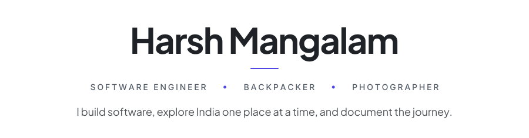

<p align="center">
  <picture>
    <source media="(prefers-color-scheme: dark)" srcset="./assets/hero-dark.svg" />
    <source media="(prefers-color-scheme: light)" srcset="./assets/hero-light.svg" />
    
  </picture>
</p>

<p align="center">
  <a href="https://www.linkedin.com/in/harshmangalam/"></a>
  <a href="https://twitter.com/harshmangalam_"></a>
  <a href="https://dev.to/harshmangalam"></a>
  <a href="https://stackoverflow.com/users/11879558/harsh-mangalam"></a>
  <a href="https://www.npmjs.com/~harshdev"></a>
  <a href="https://linktr.ee/harshmangalam"></a>
</p>

<p align="center">
  
  <a href="https://github.com/harshmangalam?tab=followers"></a>
  
</p>

---

## 👋 About Me

```ts
const harsh = {
  role: "Product-Focused Full-Stack Engineer",
  company: "GalaxEye 🛰️",
  location: "Bengaluru, India",
  code: {
    languages: ["TypeScript", "JavaScript", "Go", "Rust", "Python"],
    frontend: ["React", "Next.js", "Qwik", "SolidJS", "SvelteKit"],
    backend: ["Node.js", "Bun (Elysia)", "Deno (Fresh)", "FastAPI", "GraphQL"],
    data: ["PostgreSQL", "MongoDB", "Prisma", "Supabase"],
  },
  openSource: ["Qwik", "Remix", "Fresh", "Medusa", "SolidJS", "Expo"],
  offline: ["Backpacking across India 🎒", "Photography 📷"],
  askMeAbout: ["Web performance", "System design", "Real-time apps", "Qwik"],
};
```

- 🛰️ Building products at **[GalaxEye](https://www.galaxeye.space/)**
- 🌱 Open source contributor to **Qwik, Remix, Fresh, Medusa, SolidJS, Expo** and more
- 🎤 Tech speaker at **React** & **ReactPlay** Bangalore meetups
- 🏆 **Shotstack Hackathon** winner (2022)
- ✍️ Writing about system design, performance and web dev on **[dev.to](https://dev.to/harshmangalam)**
- 📦 Author of Qwik libraries on **[npm](https://www.npmjs.com/~harshdev)**

---

## 🛠️ Tech Stack

<p align="center">
  <a href="https://skillicons.dev">
    
  </a>
  <br />
  <a href="https://skillicons.dev">
    
  </a>
  <br /><br />
  
  
  
  
</p>

---

## 🚀 Featured Projects

| Project | Stack | Description | Stars |
| --- | --- | --- | --- |
| **[hydrogen-solidjs-client](https://github.com/harshmangalam/hydrogen-solidjs-client)** | SolidJS | Social media web app |  |
| **[qwik-x](https://github.com/harshmangalam/qwik-x)** | Qwik City | Twitter-like social media app |  |
| **[sveltekit-video-meet](https://github.com/harshmangalam/sveltekit-video-meet)** | SvelteKit · Socket.io | Video calling web app |  |
| **[faststream-server](https://github.com/harshmangalam/faststream-server)** | FastAPI · SQLModel | Video upload & streaming API |  |
| **[elysia-blog-api](https://github.com/harshmangalam/elysia-blog-api)** | Bun · Elysia · Prisma | Full-featured blog API |  |
| **[freshHub](https://github.com/harshmangalam/freshHub)** | Deno Fresh | Full-stack app on the GitHub REST API |  |

<details>
<summary><b>📦 Open source libraries</b></summary>
<br />

| Library | What it does |
| --- | --- |
| [qwik-wrap-balancer](https://github.com/harshmangalam/qwik-wrap-balancer) | Qwik component that makes titles more readable |
| [qwik-spin-delay](https://github.com/harshmangalam/qwik-spin-delay) | Smart spinner that manages loading-state duration |
| [qwik-excel-renderer](https://github.com/harshmangalam/qwik-excel-renderer) | Render and display Excel sheets in Qwik |
| [qwik-localstorage](https://github.com/harshmangalam/qwik-localstorage) | Qwik hook for localStorage access |
| [medusa-sdk-golang](https://github.com/harshmangalam/medusa-sdk-golang) | Medusa SDK for Go |

</details>

<details>
<summary><b>🧪 More things I've built</b></summary>
<br />

| Project | Stack | Description |
| --- | --- | --- |
| [solid-meet](https://github.com/harshmangalam/solid-meet) | SolidJS | Open source video meetings |
| [qwik-meet](https://github.com/harshmangalam/qwik-meet) | Qwik City | Video calling web app |
| [ffmpeg-solidjs](https://github.com/harshmangalam/ffmpeg-solidjs) | SolidJS · FFmpeg | In-browser video processing |
| [event-blend-frontend](https://github.com/harshmangalam/event-blend-frontend) | Qwik | Open source Meetup alternative |
| [threads.qwik](https://github.com/harshmangalam/threads.qwik) | Qwik | Threads clone |
| [supabook](https://github.com/harshmangalam/supabook) | Next.js · Supabase | Social media web app |
| [golang-mobile-otp-auth](https://github.com/harshmangalam/golang-mobile-otp-auth) | Go | Mobile OTP authentication |
| [mongogram-api](https://github.com/harshmangalam/mongogram-api) | Go · Fiber · MongoDB | Social media REST API |

</details>

---

## ✍️ Latest Blog Posts

<!-- BLOG-POST-LIST:START -->
- [Read my articles on dev.to](https://dev.to/harshmangalam)
<!-- BLOG-POST-LIST:END -->

---

## 📊 GitHub Analytics

<p align="center">
  
  
  
</p>

<p align="center">
  
</p>

<p align="center">
  
</p>

<p align="center">
  <picture>
    <source media="(prefers-color-scheme: dark)" srcset="https://raw.githubusercontent.com/harshmangalam/harshmangalam/output/github-snake-dark.svg" />
    <source media="(prefers-color-scheme: light)" srcset="https://raw.githubusercontent.com/harshmangalam/harshmangalam/output/github-snake.svg" />
    
  </picture>
</p>

---

## 🏅 Holopin Badges

<p align="center">
  <a href="https://holopin.io/@harshmangalam"></a>
</p>

---

## 🎒 Beyond Code

When I'm not shipping code, I'm backpacking across India and shooting photos along the way.

<p align="center">
  <a href="https://www.instagram.com/harshacrossindia"></a>
  <a href="https://unsplash.com/@harshacrossindia"></a>
  <a href="https://in.pinterest.com/harshacrossindia/"></a>
  <a href="https://www.groupvoyage.in"></a>
</p>

**🤝 Giving back:** Volunteer at [SURE Trust](https://www.suretrustforruralyouth.com/) (skilling rural youth) and [Lieber Earth Foundation](https://lieberearth.org) (sustainability initiatives).

